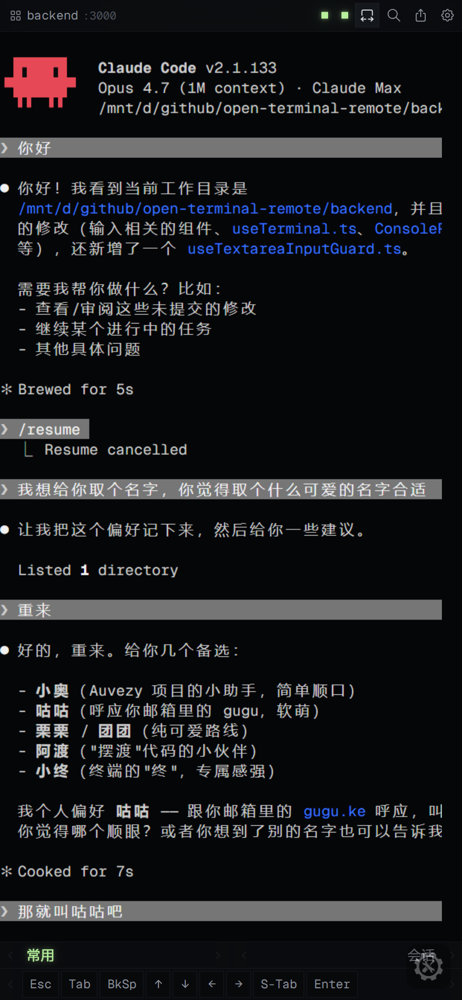

# auvezy-terminal-remote

[English](./README.md) | **简体中文**

> 局域网内通过手机 / 平板浏览器远程控制 PC 上的任意终端程序（zsh / bash / claude / 任何 CLI）。
>
> 一行命令 `atr [program] [program-args...]`，多终端多实例自动出现在浏览器顶栏 tab 切换。

<p align="center">
  
</p>

> **License: [PolyForm Noncommercial 1.0.0](./LICENSE)** —
> 个人 / 学习 / 非营利组织可自由使用、修改、再分发；商业用途需另外获得授权。

## 这是什么

你坐在沙发上拿着手机，PC 上某个 CLI（Claude Code / 部署脚本 / 调试会话…）正在跑一个长任务。你希望：

- 实时看到终端输出（包括 ANSI 颜色）
- 输入下一条指令、按方向键
- 不开公网、不依赖云

这正是这个项目要做的。把 PTY 输出经 WebSocket 桥到 webapp，
把 webapp 输入桥回 PTY。仅绑 LAN IP，用 token + 本地 cookie 鉴权。

## 快速开始

### 全局安装（npm 用户）

```bash
npm install -g auvezy-terminal-remote   # 必须 -g
```

> ⚠️ npm 页面右上角自动显示的 `npm i auvezy-terminal-remote` **缺 `-g`**——
> 这是 CLI 工具，没有 `-g` 装完不会暴露 `atr` 命令。请按上面那行装。

之后任意终端 —— 完整语法是 `atr [atr 自身 flag...] [program] [program 参数...]`：

```bash
atr                            # 跑当前 $SHELL（zsh / bash 自动检测）
atr claude                     # 跑 claude
atr zsh                        # 跑 zsh
atr claude --resume foo        # 未识别的参数自动透传给 claude
atr -p 3001 --name api claude  # atr 自身 flag + program + program 参数可共存
atr claude -- --port 8080      # program 自己的 flag 与 atr 同名时用 `--` 显式分隔
                               # （这里 --port 会被传给 claude，而非 atr）
```

`atr` 自己的 flag（`-p / --port`、`--name`、`--no-terminal` 等）无论写在哪个位置都会被 atr 自己吃掉；
program 后面 atr 不认识的参数则透传给子进程。如果你想强行让 atr 停止解析、把后续参数全部交给子进程，加 `--` 显式分隔即可。

启动后扫终端打印的二维码 → webapp 自动登录（token 在 `~/.auvezy/terminal-remote/config.json`）。

**多实例**：在不同终端多次 `atr [program]`，每次会自动占一个新端口（3000、3001、3002…），
浏览器顶栏会自动出现新 tab，点击即可切换。

```bash
atr list                  # 列出本机所有实例
atr stop                  # 停止本机所有实例
atr attach <url>          # 命令行接管已有实例
```

### 源码方式（开发或自构建）

```bash
# GitHub
git clone https://github.com/jjj201200/auvezy-terminal-remote.git
# 或 Gitee 镜像
git clone https://gitee.com/drowsyflesh/auvezy-terminal-remote.git

cd auvezy-terminal-remote
bash install.sh           # 检查 Node 20+/pnpm 9+/编译依赖 → 装包 → 构建
node backend/dist/cli.js  # 等价于 atr
```


## 已实现特性

下列功能均**已落地于当前版本**。"考虑中 / 计划中 / 不会做" 的清单见下面 [路线图](#路线图)。

**核心终端**

- 完整 PTY 桥接（node-pty + xterm.js 5），ANSI 颜色、alt-screen / TUI 友好的滚动缓冲、可配置 ANSI 过滤
- 重连回放 —— 每次重连 OutputBuffer 自动回灌 scrollback；alt-screen 全程类 TUI（claude / tmux / vim / htop …）由可扩展黑名单保护，重连不会一片空白
- 增量重画修复（针对 Ink / Claude / Yoga 这类 resize 后不会自动 reflow 的 TUI，使用 double-pulse 策略）
- 会话 TTL + 空闲断连处理，可配置

**多实例**

- 一个终端跑一个 `atr` —— 每个实例自动占下一个空闲端口（3000、3001、3002…），同一个浏览器顶栏 tab 全部展示，点击切换
- `instances/<port>.json` 注册表，文件锁 + 原子写、僵尸 PID 清理、本机所有实例共享 token
- `atr list` / `atr stop [pattern]` / `atr attach <url>` 子命令

**多客户端（master / slave 主从仲裁）**

- 同一实例可同时连入多浏览器 / 多 tab / `attach` 客户端
- 主从仲裁：webapp > attach > 本机 PC，可按会话切换
- 顶栏"适配当前设备"按钮，让 PTY 尺寸接管到当前活跃设备的视口

**移动端 webapp**

- PWA（manifest + service worker），iOS Safari / Android Chrome 可"添加到主屏幕"，运行时无浏览器 UI、状态栏与 app 同色
- 移动端输入：专用输入栏 + 工具栏 + IME composition guard（隔离 iOS / Android 键盘的预测输入污染）
- 触摸手势：长按进度指示、滑动滚动、动量保留、虚拟键盘安全区适配、视口感知 fit
- 移动端实例切换 sheet + 分享 sheet（URL / 二维码复制）
- iOS 专项：禁用 WebGL、helper-textarea 预测输入抑制、focus 劫持兜底

**设置面板**（webapp 内调，写回 `~/.auvezy/terminal-remote/config.json`）

- 通用（语言、主题、字号、字间距）
- 显示（xterm 主题选择，含 16 色 / Campbell / 自定义）
- 快捷键（自定义按键，分桶分组，拖拽排序）
- 命令（保存的命令片段，分组）
- 控制（输入模式切换、TUI tap-to-focus、scrollback 选项）
- 网络（display-IP 覆盖、CORS allow list 查看）
- 操作（实例级快捷动作）
- 关于（版本、仓库链接、协议）
- 开发者 tab（debug 开关、console-bridge 配置）

**鉴权与安全**

- 64 位 hex token，`timingSafeEqual` 比较
- 端口绑定 session cookie（cookie name 按端口加后缀 → 多实例间不会串）
- 默认仅绑 LAN；`OCR_CORS_ALLOW` 可配置 CORS allow list
- `/api/hook` 仅接受 loopback（127.0.0.1 / ::1）
- 工作目录白名单防路径穿越
- 配置文件 0o600，目录 0o700
- 鉴权请求 per-IP 限流

**网络感知**

- IP 漂移检测：30s 轮询 + 稳定阈值，向客户端广播 `ip_changed` 并弹 toast 提示
- 多网卡 display IP 启发式 + 诊断 banner 输出（LAN + Tailscale 双码）
- WSL2 mirrored / NAT 模式自动检测 + 首次启动生成 PowerShell 端口转发脚本

**CLI 体验**

- Banner 含彩色二维码（LAN + Tailscale 可用时双码）
- `--dev-proxy` 本地前端开发（vite 端口 5173–5180 自动探活，10s 缓存）
- `--spawn-timeout`、`--wait-confirm`、`--no-terminal`、`--strict-port`、`--name`、`--workdir`、`--token` …

**审批 hook（Claude Code 集成）**

- `/api/hook` 接受 Claude 审批事件（仅 loopback）
- `console-bridge`：前端 `console.*` 经 WS 转发到 backend stderr，方便跨设备调试

### 速查（技术映射）

| 功能 | 实现 |
|---|---|
| PTY 桥接 | node-pty + xterm.js 5 |
| 鉴权 | timingSafeEqual token + Session Cookie（端口绑定）|
| 多实例 | port-finder 自动递增 + cookie name 后缀隔离 |
| 重连回放 | OutputBuffer + history_sync（默认过滤 alt-screen）|
| IP 漂移检测 | 30s 轮询 + 稳定阈值 + ip_changed 广播 |
| 配置改写 | webapp Settings 弹窗 → /api/config |
| attach 子命令 | 主从仲裁（webapp > attach > PC）|

## 配置

启动时自动读 `~/.auvezy/terminal-remote/config.json`，结构：

```json
{
  "token": "<64位 hex 自动生成>",
  "shortcuts": [
    { "label": "ESC", "data": "" },
    { "label": "↑",   "data": "" }
  ],
  "command": null,
  "args": null,
  "rateLimitPerMinute": 10,
  "sessionTtlMs": 86400000
}
```

多实例注册表在 `instances/<port>.json`。

## 启动选项

```
atr [atr 自身 flag...] [program] [program 参数...]
atr <子命令> [参数]

子命令（与 [program] 互斥）：
  start          启动 backend（默认 —— 不显式给子命令时即此项）
  attach <url>   attach 到运行中的实例（命令行接管）
  list           列出本机所有运行中实例
  stop [pattern] 停止本机所有实例（可选名字 pattern）

选项：
  -p, --port <n>      端口（默认 3000，多实例自动递增；除非 -S）
  -S, --strict-port   严格端口模式：被占即报错退出，不自适应
  --spawn-timeout <s> PTY spawn 兜底秒数（默认 30；0=不超时；
                      首个浏览器连入 / 按 Enter / 超时三选一触发）
  --wait-confirm      强制必须按 Enter 才 spawn（覆盖浏览器/超时触发）
  --name <s>          实例名（用于 webapp 显示）
  --no-terminal       不打印二维码（CI / 守护进程友好）
  --command <cmd>     PTY 启动命令（默认 'claude'）
  --args <json>       命令参数（JSON 数组字符串）
  -h, --help          显示帮助
  -v, --version       显示版本号
```

环境变量：

| 变量 | 用途 |
|---|---|
| `OCR_COMMAND` | 子进程命令（默认 `$SHELL`，没有则 `/bin/sh`；显式设为 `claude` 跑 Claude）|
| `OCR_ARGS`    | 命令参数（JSON 数组字符串，如 `'["-c","tail -f /dev/null"]'`）|
| `OCR_CWD`     | 子进程工作目录（默认 `process.cwd()`）|
| `OCR_ANSI_FILTER` | 是否过滤 alt-screen 输出（默认 `false`）。设 `true` 让 vim/htop 退出后重连回放更干净；但全程 alt-screen TUI（claude/tmux/...）仍受内置黑名单保护，自动豁免不会空白 |
| `OCR_ANSI_FILTER_TUI_NAMES` | 追加自家 alt-screen TUI 黑名单（逗号分隔），例如 `"lazygit,k9s,gh-dash"` |
| `PORT`        | 同 `--port` |
| `STRICT_PORT` | 同 `--strict-port`（设 `true` 启用严格模式）|
| `OCR_SPAWN_TIMEOUT` | 同 `--spawn-timeout`（秒；0 = 无超时）|
| `AUTH_TOKEN`  | 指定 token（默认自动生成）|
| `LOG_LEVEL`   | pino 级别（默认 info）|

## 安装为 PWA（手机推荐）

webapp 自带 manifest，可"添加到主屏幕"获得近原生 app 体验：

- **Android Chrome**：右上角 ⋮ → "安装应用"（或地址栏会自动弹"安装"提示）
- **iOS Safari**：分享按钮 → "添加到主屏幕"

启动后无浏览器 UI（无地址栏、无底部导航），独立任务卡片，状态栏与 app 同色。

## 在 WSL 中跑、Windows 浏览器访问

WSL2 的两种网络模式行为不同：

- **mirrored 模式**（Win11 22H2+ 默认）：WSL 直接拿 Windows LAN IP（如 `192.168.x.x`），
  Windows 浏览器可以直接用 banner 上的 IP 访问，无需任何额外配置
- **NAT 模式**（默认）：WSL 在 `172.x.x.x` 私网，Windows 浏览器无法直连。
  backend 启动时会自动检测并在 banner 末尾打印 PowerShell 配置命令

**一键自动配置**（管理员 PowerShell）：

```powershell
# 转发常用端口范围（默认 3000-3010）
.\scripts\wsl-port-forward.ps1

# 仅转发指定端口
.\scripts\wsl-port-forward.ps1 -Ports 3000,3001

# 注册到登录时自动重配（WSL 重启后 IP 变了无需手动跑）
.\scripts\wsl-port-forward.ps1 -Persist

# 清理
.\scripts\wsl-port-forward.ps1 -Reset
```

## 架构 / 决策

- 设计文档：[`docs/plans/open-claude-remote-clone/design.md`](./docs/plans/open-claude-remote-clone/design.md)
- 模块图与数据流：[`docs/ARCHITECTURE.md`](./docs/ARCHITECTURE.md)
- 关键决策（ADR）：[`docs/plans/open-claude-remote-clone/adrs/`](./docs/plans/open-claude-remote-clone/adrs/)

## 开发

```bash
pnpm install
pnpm dev          # backend (tsx watch) + frontend (vite) 并行
pnpm test         # shared + backend + frontend 单测
pnpm typecheck
pnpm build        # 交付构件（含 frontend 拷入 backend/frontend-dist）
```


## 路线图

> **下面列的全部是 _计划中 / 评估中 / 明确不做_ 的功能 —— 尚未实现。**
> 当前版本已经实现的内容见上面 [已实现特性](#已实现特性)。各档按"投入产出比"排序，越靠后的优先级越低。

### 第一档 — 计划中（移动端必加，工作量小，明显改善体验）

1. **Local Echo 本地预回显**（参考 Mosh / Blink / code-server）
   移动端 4G / 弱网下输入延迟的杀手。xterm 预测插件让按键立刻显示，PTY 回包覆盖。投入低收益巨大。
2. **多行粘贴警告 + bracketed paste**（参考 VS Code、Tabby）
   移动端从微信 / 邮件粘贴多行命令直接进 PTY 风险高，检测多行 → 弹确认。
3. **Shell Integration 子集（OSC 633/133）**
   - command decorations（绿 / 红圆点）
   - Run Recent Command 跨会话 fuzzy 历史 quick pick
   对手机用户极友好（手机打字慢 → 跨会话历史搜索是核心需求）。
4. **Auto Reply（自动应答）**（参考 VS Code）
   匹配 prompt 自动回 y/N，免去手机敲 `[y/N]` 的麻烦。
5. **Process Revive（终端复活）**（参考 VS Code）
   把 scrollback 序列化进 instances.json，重启后 webapp 能看到上次的内容。
6. **审批推送通知**（Claude Code hook → 手机锁屏）
   `/api/hook` 收到 Claude 审批事件后扇出推送给所有已订阅设备。Web Push（VAPID）
   走 Android Chrome / 桌面浏览器；iOS Safari fallback 用 webapp 内 LocalNotification。
   后端骨架（vapid.json、push-routes、push-service）已经写了一部分，但端到端流程
   还没接通，需要 HTTPS 链路（Tailscale / 自签证书）和订阅 UX 打磨。

### 第二档 — 计划中（移动端体验加分）

6. **SmartKeys 长按出菜单**（参考 Blink）
   屏幕键盘扩展行：长按 Tab → Shift+Tab；长按 Esc → `^[`；长按 Ctrl → 黏滞到下个键。当前 Toolbar 快捷键面板已成型，缺"长按弹菜单"+"修饰键黏滞"。
7. **拇指拖光标条**（参考 Termius 的"长按空格当 trackpad"）
   终端区底部 8px 透明条，拖动 = 发方向键序列。手机精确移光标的最优解。
8. **OSC 8 hyperlinks + word-link / file-link**（参考 VS Code）
   xterm.js 原生 LinkProvider，加几行就能让 `src/foo.ts:42` 变可点击。
9. **多 chord 快捷键 / 修饰键黏滞**（参考 Tabby、Blink）
   手机虚拟修饰键 + `Cmd-K Cmd-S` 这类两步组合，比堆按钮更节省屏幕。
10. **Quick Fixes**（参考 VS Code）
    扫描输出推荐修复，例如 `fatal: ... --set-upstream` 一键应用。投入大但很出彩。

### 第三档 — 计划中（写权限 / 安全 / 协作）

11. **Writable / Read-only 分离**（参考 ttyd `-W`、gotty `-w`）
    多设备同时连入同一实例时可设其他人只读。投入很小（WS 握手时区分）。
12. **Broadcast Input 多终端同步输入**（参考 Termius）
    多个 webapp 同连一个实例时，把同一输入广播给所有 PTY。当前多实例架构很容易加。
13. **TLS 自签证书**（参考 ttyd `-S`、gotty `-t`）
    LAN 内 HTTPS，让 Web Push API 在更多浏览器上能用（目前 LAN HTTP 下 Push API 受限）。
14. **OAuth / 客户端证书鉴权**（参考 ttyd 客户端证书）
    在现有 token 之上加客户端证书做硬鉴权。优先级低 —— token 已经够用。

### 第四档 — 不会做（明确放弃）

- ❌ **插件系统**（Tabby）：LAN-only 单 binary 没必要
- ❌ **云端 Settings Sync**（VS Code）：跟 LAN-only 红线冲突
- ❌ **Sixel / iTerm 图像协议**：移动端价值低，xterm.js 不原生
- ❌ **asciinema 公网分享**：跟 LAN-only 冲突；要做就只做本地 `.cast` 导出
- ❌ **SFTP / SCP 文件管理**（Termius / Wetty）：偏离"远程 PTY 控制"定位
- ❌ **端到端加密 Vault**：家庭 LAN 不需要