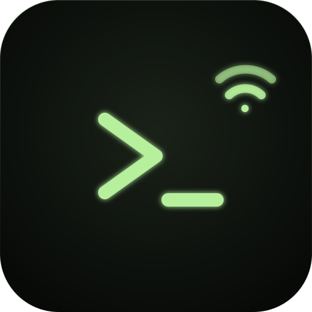
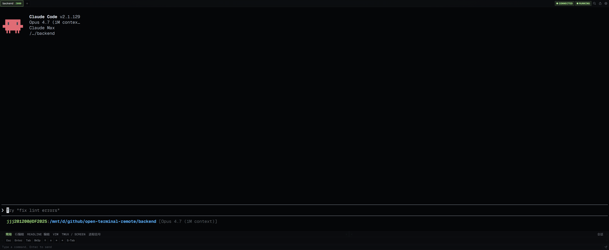

<div align="center">



# auvezy-terminal-remote

[](https://www.npmjs.com/package/auvezy-terminal-remote)
[](./LICENSE)
[](https://nodejs.org)
[](https://github.com/jjj201200/auvezy-terminal-remote)

[English](./README.md) · **简体中文**

局域网内通过手机 / 平板浏览器远程控制 PC 上的任意终端程序。
开机起一次 broker，浏览器打开就能登录、创建实例、跑 Claude / shell / 任何 TUI。




</div>

## ✨ 核心特性

- **移动浏览器作为一等终端客户端** —— 任意手机浏览器即可获得完整 PTY 体验，
  支持 `claude` / `vim` / `htop` / shell 等任意程序。移动端 UI 内置屏幕快捷键、
  IME 安全输入、滑动滚屏、视口自适应排版，并支持以 PWA 形式添加到主屏。
- **TUI / Claude Code 适配** —— 处理 Ink/Yoga 在 resize 时不 reflow 的问题，
  避免设备转屏后 Claude 出现空白；alt-screen 黑名单确保
  `claude` / `tmux` / `lazygit` 等全屏 TUI 重连后界面完整。
- **重连回放** —— 每次重连自动回灌 scrollback，瞬时网络抖动、锁屏或设备
  休眠不会丢失上下文。
- **多实例与统一 tab 栏** —— 每次 `atr <program>` 派生独立子进程并对应独立
  URL（`/i/<id>/`），webapp 在单一 tab 栏中聚合展示所有活实例。
- **可配置的设置面板** —— 屏幕快捷键、命令片段、按设备字号、终端主题、
  scrollback 行数、hook 集成等均可由用户配置；偏好持久化至 `~/.atrrc`。
- **LAN-only 架构** —— 单一共享 token（timing-safe 比较）、worker 仅监听
  `127.0.0.1`、broker 作为唯一对外入口；无公网服务器、无第三方中继。
- **一键开机自启** —— `atr install` 生成 systemd / launchd 配置，重启后服务
  自动启动。

完整清单见 [`docs/FEATURES.zh-CN.md`](./docs/FEATURES.zh-CN.md)。

## 🏛️ 架构

`atr` 是双进程模型：**broker** 负责对外入口与协调，**worker** 负责单个 PTY 实例。

```
        浏览器 / 手机                    本机 PC
        ┌──────────────┐                ┌─────────────────────────────────┐
        │              │   ws://host    │  broker (LAN: 0.0.0.0:3000)     │
        │  webapp PWA  │ ──────────────►│  ├─ /api/*  (auth/instances/... │
        │              │                │  │           push / config)     │
        │              │                │  ├─ /i/<id>/  → SPA + base href │
        │              │                │  ├─ /i/<id>/api/* → 反代 worker │
        │              │                │  └─ /i/<id>/ws    → 反代 worker │
        └──────────────┘                │            │                    │
                                        │            ▼                    │
                                        │  worker A   worker B   …        │
                                        │  127.0.0.1: 127.0.0.1:          │
                                        │  3001       3002       …        │
                                        │  ├─ PTY (claude / shell / TUI)  │
                                        │  ├─ /api/health  /api/hook      │
                                        │  └─ /ws (PTY IO)                │
                                        └─────────────────────────────────┘
```

- **broker**（LAN 入口）：唯一对外暴露的进程，监听 `0.0.0.0:3000`。
  持有所有"系统级" API：登录、用户配置、实例列表、推送订阅、SSE 实时流；
  服务前端静态资源，自动给 `/i/<id>/` 注入 `<base href>`。永驻——开机起一次就够。
- **worker**（PTY 实例）：每个实例一个独立子进程，仅监听 `127.0.0.1` 高位端口；
  只暴露 `/api/health`（探活）、`/api/hook`（loopback only）、`/ws`（PTY IO）。
  由 broker 通过 `POST /api/instances` 派生，detached + unref 后独立生命周期。
- **共享 session**：broker / worker 共用文件锁的 sessions store，cookie 一处签发处处认。
- **入口模型**：浏览器永远访问 broker；URL `/i/<id>/` 区分实例，刷新不丢上下文，单 PWA 多实例。

模块图与详细数据流见 [`docs/ARCHITECTURE.md`](./docs/ARCHITECTURE.md)；
设计决策（broker/worker 分离、永驻、API 归属、base href 注入等）见
[`docs/plans/path-routing/adrs/`](./docs/plans/path-routing/adrs/)。

## 📦 安装

```bash
npm install -g auvezy-terminal-remote   # 必须 -g（这是 CLI 工具）
```

> ⚠️ npm 包页面右上角自动显示的 `npm i` 命令**缺 `-g`**，没 `-g` 装完不会暴露
> `atr` 命令。

## 🚀 快速开始

### 一次性启动后台服务（推荐：开机自启）

```bash
atr install              # 写 systemd（Linux/WSL2） / launchd（macOS）配置
# 之后按提示 enable + start，开机自动起后台服务
```

或手动启动一次（测试 / 不需要开机自启时）：

```bash
atr start                # 前台跑，Ctrl+C 退；服务化请走上面那条
```

### 浏览器打开

```bash
atr status               # 一屏看清：进程 / token / 入口 URL / 实例
```

输出里"可访问入口"那段每条 URL 都带 `?token=<token>`，复制任一条到浏览器即自动登录。
默认入口标 ★（Tailscale 优先 → LAN → IPv6 → loopback）。

webapp 打开后看到主界面，点 "+ 新实例"选 cwd 即可创建一个 PTY 实例（默认跑 `$SHELL`，可在 cwd 内手动起 claude 等）。

### 直接派生一个实例（CLI 兼容旧用法）

```bash
atr                          # 跑当前 $SHELL
atr claude                   # 跑 claude
atr claude --resume foo      # 额外参数自动透传
```

CLI 启动会自动确保后台服务在线（不在则 fork 一个），然后派生实例并打印对应 URL。

## 🔧 用法

```
atr [启动 flag...] [program] [args...]  启动一个 PTY 实例（默认）
atr <子命令> [参数]                      管理 broker / 实例
```

严格参数顺序：atr 自己的 flag 必须放在 `[program]` **之前**。一旦遇到 program
名，之后所有 token 原样透传给子进程。

### 子命令

| 命令 | 用途 |
|---|---|
| `atr start [--port n] [--host ip]` | 启动 broker（前台，Ctrl+C 退） |
| `atr stop` | 停 broker（SIGTERM → 5s 宽限 → SIGKILL） |
| `atr status` | 一屏看清服务详情：进程、token、入口 URL、实例 |
| `atr list` | 列当前所有活实例 |
| `atr logs` | tail 当天 broker 日志（`~/.atr/broker-YYYY-MM-DD.log`） |
| `atr install` | 注册开机自启（systemd / launchd） |
| `atr uninstall` | 卸载开机自启（带二次确认） |
| `atr attach <url>` | 命令行客户端连入某实例（第二个终端共享同一 PTY） |
| `atr kill <pattern \| all>` | 杀实例（子串匹配 name/cwd/host:port）；`all` 杀全部（带确认） |
| `atr completion <zsh\|bash\|fish>` | 输出对应 shell 补全脚本到 stdout |

保留词（上面这些子命令）在位置 0 一律识别为 subcommand。要跑同名 PATH 二进制：
`atr ./<name>` 或 `atr -- <name>`。在交互终端下，atr 会 prompt 让你选。

### 启动 flag（用于 `atr [program]`）

| Flag | 用途 |
|---|---|
| `-p, --port <n>` | 后台服务端口（默认 3000）。实例端口由后台自动分配 |
| `--name <s>` | 实例名（webapp 显示用） |
| `--no-terminal` | 不打印二维码（CI / 守护进程友好） |
| `--workdir <path>` | 子进程工作目录 |
| `--token <s>` | 指定固定 token（默认从 `~/.atrrc` 读 / 自动生成） |

完整参考（所有 flag、env、配置文件）见 [`docs/CLI.zh-CN.md`](./docs/CLI.zh-CN.md)。
跑 `atr -h` 查看内置帮助。

## 📂 文件位置

| 路径 | 内容 |
|---|---|
| `~/.atrrc` | 主配置：token、用户偏好、快捷键、命令片段 |
| `~/.atr/instances.json` | 当前活实例注册表（broker / worker 共享） |
| `~/.atr/broker.json` | broker 进程状态（pid / port / 启动时间） |
| `~/.atr/broker-YYYY-MM-DD.log` | broker 进程日志（按天切，保留 7 天） |
| `~/.atr/sessions/` | 共享 session 文件 |
| `~/.atr/vapid-keys.json` | Web Push VAPID 密钥 |
| `~/.atr/push-subscriptions.json` | 已订阅的推送终端 |

## 📱 安装为 PWA

webapp 自带 manifest，可"添加到主屏幕"获得近原生 app 体验：无浏览器 UI、状态栏与 app 同色。

- **iOS Safari** —— 分享按钮 → "添加到主屏幕"
- **Android Chrome** —— 右上角 ⋮ → "安装应用"

## 🌐 WSL → Windows 浏览器

WSL2 在 **mirrored 模式** 下开箱即用。**NAT 模式** 下 banner 会打印一段
PowerShell 命令，跑一次就能从 Windows 访问该端口。详见
[`docs/WSL.zh-CN.md`](./docs/WSL.zh-CN.md)。

## 🛣️ 路线图

计划中 / 评估中 / 明确不做的功能见 [`docs/ROADMAP.zh-CN.md`](./docs/ROADMAP.zh-CN.md)。
README 里只列已经实现的。

## 🛠️ 开发

```bash
git clone https://github.com/jjj201200/auvezy-terminal-remote.git
cd auvezy-terminal-remote
bash install.sh            # 检查 Node 20+ / pnpm 9+ / 编译依赖 → 装包 → 构建
```

dev 启动顺序（broker 先于 vite）：

```bash
# 终端 1：起 broker（dev 模式，tsx 直跑 src）
pnpm --filter auvezy-terminal-remote exec tsx src/cli.ts start

# 终端 2：vite dev server，反代 /api 与 /i/ 到 broker (3000)
pnpm --filter auvezy-terminal-remote-frontend dev
# 浏览器打开 http://localhost:5173/
```

跑测试：

```bash
pnpm test                  # shared + backend + frontend 单测
```

Gitee 镜像（国内访问更快）：
`git clone https://gitee.com/drowsyflesh/auvezy-terminal-remote.git`

## License

[PolyForm Noncommercial 1.0.0](./LICENSE) —— 个人 / 学习 / 非营利组织可自由使用、修改、再分发；
商业用途需另外获得授权。
